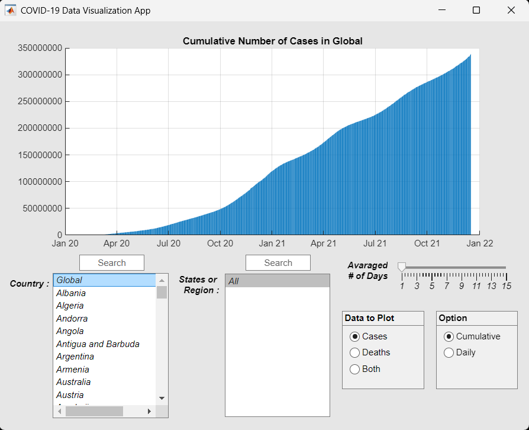

# 🦠 COVID-19 Data Visualization App (Standalone EXE)

This is a **standalone desktop application** built using **MATLAB App Designer**, compiled into an `.exe` file so it **does not require MATLAB** to be installed on the user’s machine. The app provides interactive visualizations of global COVID-19 data using modern GUI elements.

---

## 🚀 Features

- ✅ **No MATLAB Required** — packaged using MATLAB Compiler
- 📊 **Cases & Deaths Visualization** on dual Y-axes
- 🌍 View **Global**, **Country**, or **State/Region** data
- 📈 Toggle between **Cumulative** or **Daily** views
- 🧮 Adjustable **Moving Average Window (1–15 days)**
- 🔎 Optional **Search Box** for faster navigation
- 📅 Automatic **Date Formatting** on X-axis

---

## 📦 Installation

1. Download the installer from the StandaloneApp.exe(#) folder.
2. Run the `setup.exe` installer.
3. Follow the on-screen instructions to complete installation.

> ⚠️ **First-Time Requirement:**  
> You must install the **MATLAB Runtime**, which will be automatically prompted during installation if not already installed.

---

## 🧠 App Description

This COVID-19 data visualization tool was developed for a course project to apply object-oriented programming, data processing, and UI design to a real-world dataset. The app uses data provided by the **Johns Hopkins University Coronavirus Resource Center**, covering cases and deaths globally.

---

## 🗂️ Application Components

- Dual-axis plot (cases and deaths)
- Country and State selection
- Search Box
- Moving average smoothing
- Daily vs cumulative toggle
- Fully responsive UI

---

## 📝 How to Use

1. Launch the app from your desktop/start menu
2. The `covid_data.mat` file (prompted on startup) no load required
3. Use the left panel to select:
   - Country or Global
   - State/Region (if available)
   - Data type: Cases / Deaths / Both
   - Moving average (1–15 days)
   - Daily or Cumulative view
4. The plot will update automatically with your selections

---

## 📷 Screenshots

Here are some screenshots of the COVID-19 Data Visualization App in action:

### Global Daily Cases and Deaths (with 7-day Moving Average)

## ❓ FAQ

**Q: Do I need MATLAB to run the app?**  
**A:** No. The app is compiled and uses the free MATLAB Runtime, which is bundled or linked during installation.

**Q: Where do I get the `covid_data.mat` file?**  
**A:** It is included with the app package, or you can download the latest version from the [Johns Hopkins COVID-19 Resource Center](https://coronavirus.jhu.edu/).

---

## 🙏 Credits

- COVID-19 data from [Johns Hopkins University](https://coronavirus.jhu.edu/)
- Developed using **MATLAB App Designer** and **MATLAB Compiler**
